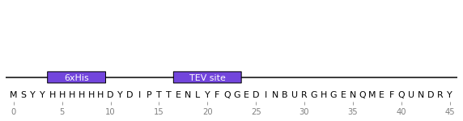

# Minotaor

**Under construction**

Minotaor is an a**mino** acid sequence anno**ta**t**or** for quickly identifying common protein tags and linkers in an ORF. Additionally, it can flag peptide sequences or patterns that are known to cause problems during translation. It uses Biopython.


## Usage

```python
import minotaor
protein = minotaor.Seq("MSYYHHHHHHDYDIPTTENLYFQGEDINBURGHGENQMEFQUNDRY")
protein_record = minotaor.SeqRecord(protein, id="example", annotations={"molecule_type": "protein"})

protein_record = minotaor.annotate_record(protein_record)

from dna_features_viewer import BiopythonTranslator
graphic_record = BiopythonTranslator().translate_record(protein_record)
ax, _ = graphic_record.plot(figure_width=10, strand_in_label_threshold=7)
graphic_record.plot_sequence(ax)
```

